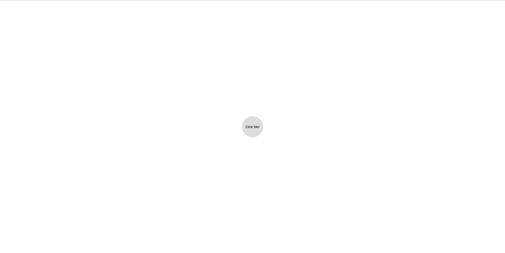
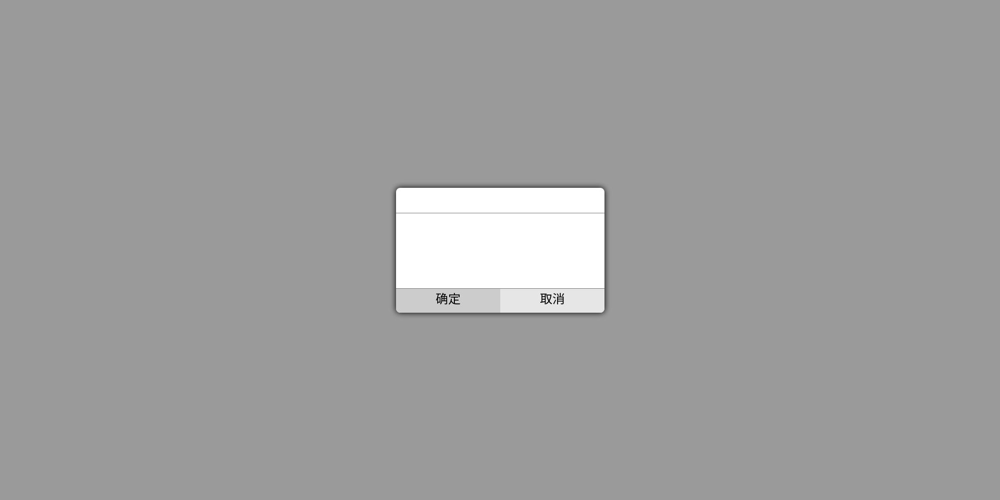

# 基于Jquery和css3的简易dialog模板
## 说明
1. 一直以来就对浏览器的弹出框的实现很是好奇，正好乘着一点空闲时间，稍微玩了玩。若有什么不足之处，希望能指出，大家一起学习学习
2. 本次小实验，是用与练习dialog弹出框，样式就没去顾及了，着重功能的实现

## 基本原理
1. 实现的总体思路是用一个div作为蒙版，用于覆盖浏览器的整个视窗，并将该蒙版的背景设置为黑色+半透明；
而另外的弹出框，也是用一个div做出来的。
2. 实验最重要的部分就是css3的animation属性，通过它来实现弹出框的淡入淡出效果
```css
/* dialog fade in */
.show-0 {
  animation: fadeIn 0.5s ease;
  animation-fill-mode: forwards; /*动画结束后效果保持在：forwards：最后的效果  backwards：初始效果*/
}

@keyframes fadeIn {
  0% { opacity: 0; z-index: -1; }
  100% { opacity: 1; z-index: 999; }
}

/* dialog fade out */
.show-1 {
  animation: fadeOut 0.5s ease;
  animation-fill-mode: forwards; /*动画结束后效果保持在：forwards：最后的效果  backwards：初始效果*/
}

@keyframes fadeOut {
  0% { opacity: 1; z-index: 999; }
  100% { opacity: 0; z-index: -1; }
}
```
3. 通过jquery，向相应的dom元素中添加或者移去上述的类，即可实现淡入淡出的效果。
4. 有个问题，就是在dialog淡出后，虽然弹出框看不见了，但其依旧存在。目前我只是粗暴地定时，该一定时间后再加入hide类，即设置display:none。但这会有明显的延迟。。。目前还想到解决方法
```javascript
    dialog.removeClass('show-0')
      .addClass('show-1')
    setTimeout(function() {
      dialog.removeClass('show-1')
        .addClass('hide');
    }, 505);
```

## 效果

